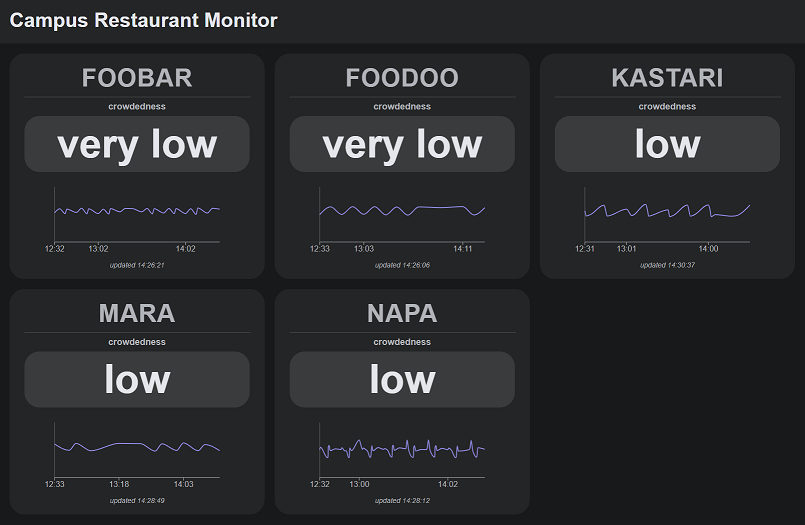

# Campus Restaurant Monitor

This project was my course work for Internet of Things in the University of Oulu during autumn 2022.

The project is an application that uses CO2 data from sensors around the Linnanmaa campus of the University of Oulu to estimate the crowdedness of the restaurants.
The project was done in groups of five and my task was to create the frontend for the web application that visualises the crowd estimations provided by our backend API.
It is written using React library and Recharts is used to plot data.

